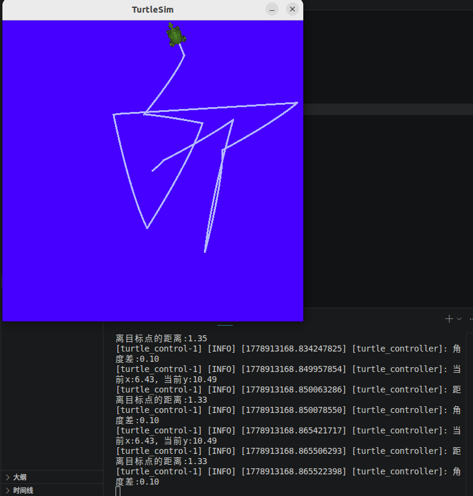

# ROS2 C++ Turtle Patrol Service

基于 ROS2 C++ Service 通信实现的海龟巡逻控制项目。

该项目实现：

- ROS2 C++ 节点开发
- turtlesim 自动巡逻
- Service 通信控制
- 动态参数修改
- launch 一键启动
- 随机运动控制

---

# Features

- ROS2 C++ 开发
- turtlesim 巡逻控制
- Service Client / Server 通信
- 动态参数更新
- launch 文件启动
- 随机巡逻逻辑
- 自动运动控制

---

# Project Structure

```text
ros2-cpp-turtle-patrol-service
├── include
├── launch
│   └── demo.launch.py
├── src
│   ├── patrol_client.cpp
│   └── turtle_control.cpp
├── CMakeLists.txt
├── package.xml
└── README.md
```

---

# Environment

- Ubuntu 22.04
- ROS2 Humble
- C++
- turtlesim

---

# Build

进入工作空间：

```bash
cd ~/ros2-cpp-turtle-patrol-service
```

编译：

```bash
colcon build
```

加载环境：

```bash
source install/setup.bash
```

---

# Run

## 启动项目

```bash
ros2 launch demo_cpp_service demo.launch.py
```

---

# Project Workflow

项目运行流程：

```text
Client Node
    ↓
发送巡逻请求
    ↓
Service Server
    ↓
生成随机控制参数
    ↓
控制 turtlesim 运动
```

---

# Functions

项目支持：

- 自动随机巡逻
- Service 通信
- 动态参数修改
- 海龟速度控制
- launch 一键启动

---

# ROS2 Concepts Used

本项目涉及：

- ROS2 Node
- ROS2 Service
- Parameter 参数
- launch 文件
- rclcpp
- turtlesim

---

# Demo

## Turtle Patrol



---

# Future Improvements

后续计划：

- 多海龟巡逻
- Action 通信
- Waypoint 导航
- 状态机控制
- Qt GUI
- 巡逻地图系统

---

# Author

ICE

---

# License

Apache License 2.0